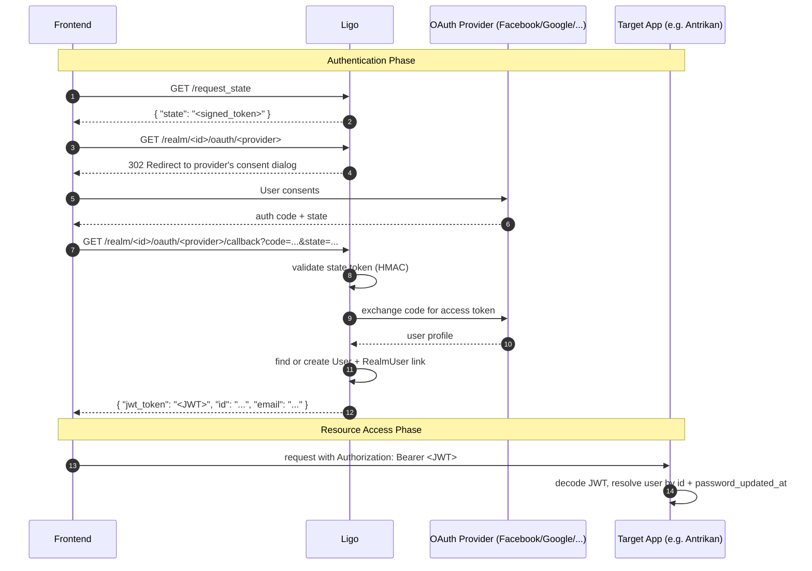
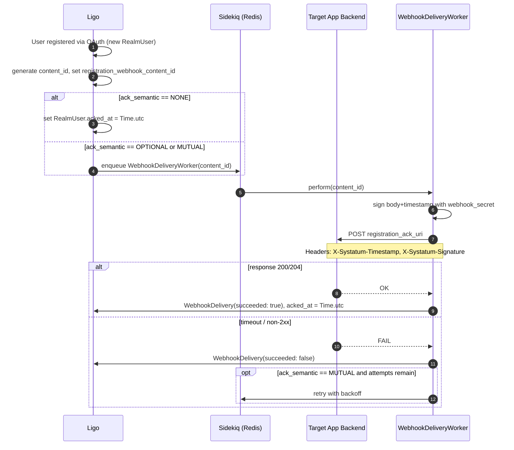

# Ligo

[](https://github.com/systatum/ligo/actions/workflows/ci.yml)

Shared Crystal/Marten engine behind Systatum's apps. Depended on as a shard by
each app (currently [Antrikan](https://github.com/systatum/antrikan) and
[Workaty](https://github.com/systatum/workaty)), which each get their own
database and install both `Ligo::App` and their own app alongside it.

Ligo owns generic mechanism - authentication, cross-app identity federation,
uploaded files, dynamic per-resource fields, websocket pub/sub, background
jobs. It deliberately does not own app-specific policy (specific roles,
specific resource meanings, specific business rules) - that stays in the
consuming app.

- [Setup](#setup)
- [Entities](#entities)
- [Route Structure](#route-structure)
- [OAuth / Realm Federation](#oauth--realm-federation)
- [Webhook Delivery](#webhook-delivery)
- [JWT Token](#jwt-token)
- [Email Verification](#email-verification)
- [Dynamic Fields](#dynamic-fields)
- [Conventions](#conventions)

## Setup

```bash
docker compose up -d
shards install
crystal run manage.cr -- migrate
crystal spec
```

Ligo also runs as its own standalone server (`src/server.cr`), mainly useful
for exercising it directly during development; in production each consuming
app links against it as a shard instead.

## Entities

| Concept | Description |
|---------|-------------|
| **User** | A person with an account. Has a canonical `iam_identifier_primary` used to resolve the same person across realms. |
| **Organization** | A group a user belongs to. |
| **Realm** | An OAuth client registration - a trusted app (e.g. Antrikan) that delegates authentication to this deployment. Each realm brings its own upstream OAuth app credentials so the user sees the correct branding. |
| **RealmUser** | A federated identity link binding a User to a specific Realm (like an OAuth `sub` per client). |
| **WebhookDelivery** | Tracks delivery attempts for outbound registration notifications sent to a realm's backend. |
| **UploadedFile** | A file committed to storage, referenced by id from any resource. |
| **FieldDefinition** / **FieldValue** | A generic per-resource custom field system. `resource_type` is a plain int: 0-99 are reserved for Ligo's own resource types (see `ResourceType`), consuming apps constantize their own starting at 100. |
| **Changelog** | An audit trail of create/update/delete changes for any model that includes `ChangeTracker`. |

## Route Structure

| Scope | Route | Method | Handler |
|-------|-------|--------|---------|
| User | `/user/signup` | POST | `SignUpHandler` |
| User | `/user/signin` | POST | `SignInHandler` |
| User | `/user/update_password` | POST | `PasswordUpdateHandler` |
| User | `/user/request_password_reset` | POST | `PasswordResetInitiateHandler` |
| User | `/user/reset_password/confirm` | POST | `PasswordResetConfirmHandler` |
| User | `/user/bio` | GET | `BioShowHandler` |
| User | `/user/bio/update` | PATCH, POST | `BioUpdateHandler` |
| User | `/user/my-picture` | POST, PATCH | `MyPictureUploadHandler` |
| User | `/user/request-email-verification` | GET | `RequestEmailVerificationHandler` |
| User | `/user/verify-email/confirm` | GET | `EmailVerifyHandler` |
| User | `/user/verify-email/form` | GET | `EmailVerificationFormHandler` |
| Realm | `/realm/create` | POST | `RealmCreateHandler` |
| Realm | `/realm/<realm_id>/oauth/<provider>` | GET | `OAuthInitiateHandler` |
| Realm | `/realm/<realm_id>/oauth/<provider>/callback` | GET | `OAuthCallbackHandler` |
| Webhook | `/webhooks/iam` | POST | `IamWebhookHandler` |
| Generic | `/request_state` | GET | `RequestStateHandler` |
| File | `/uploaded_file/<id>` | GET | `UploadedFileShowHandler` |
| Field | `/fields/create` | POST | `FieldCreateHandler` |
| Field | `/fields/<field_hashed_id>/update` | POST | `FieldUpdateHandler` |
| Field | `/fields/<field_hashed_id>/delete` | POST | `FieldDeleteHandler` |
| Field | `/fields/rt/<resource_type>/index` | GET | `FieldIndexHandler` |
| Job | `/job/<id>` | GET | `JobStatusHandler` |

There is deliberately no organization CRUD here - the old monorepo's
organization endpoints had no authorization checks at all, so they were left
out rather than ported insecure.

## OAuth / Realm Federation



Supported upstream providers: Facebook, Google, GitHub, GitLab, VK, Twitter
(see `ProviderType`). Adding another means adding it to `multi_auth`'s own
provider list and to `ProviderType`.

### State Token

CSRF protection for the OAuth callback uses HMAC-signed nonce tokens via
`SignedToken`. A `state` parameter is generated by `RequestStateHandler` and
verified in `OAuthCallbackHandler`; missing or empty state is accepted
(some frontend flows never round-trip it), but an invalid one is rejected.

## Realm Registration

When registering a new Realm via `POST /realm/create`:

1. A 12-character id is generated for the Realm.
2. Three credential pairs are created (raw values returned once, never
   stored again): `api_secret_key` (60 chars, backend-to-backend), stored as
   a SHA-256 hash; `api_client_key` (60 chars, frontend-to-Ligo), also
   hashed; `webhook_secret` (15 chars, signs outbound webhook payloads via
   `X-Systatum-Signature`).
3. The realm's upstream OAuth app credentials (`app_id`, `app_secret`) are
   stored for the OAuth flow.
4. An `ack_semantic` is chosen (see below).

## Webhook Delivery

The `ack_semantic` on a Realm controls how its backend is notified when a
new User registers through that Realm's OAuth flow:

| Semantic | Behavior |
|----------|----------|
| **NONE** | No webhook. `RealmUser#acked_at` is set immediately at creation. |
| **OPTIONAL** | A webhook `POST` is sent to `registration_ack_uri` once, no retries. `acked_at` is never set automatically. |
| **MUTUAL** | A webhook `POST` is sent with retries (up to `max_ack_retry_attempts`, default 50) until the target responds `200`/`204`. `acked_at` is set only on confirmation. |



### Webhook Payload

```json
{
  "event": "registration",
  "user_id": "<hashed_user_id>",
  "email": "user@example.com",
  "realm_user_id": 42
}
```

### Verifying an Incoming Webhook

A receiving app should verify every webhook itself:

1. Extract `X-Systatum-Timestamp` and `X-Systatum-Signature`.
2. Compute `HMAC_SHA256(body + timestamp, webhook_secret)`.
3. Compare to `X-Systatum-Signature` using constant-time comparison.
4. Discard (respond `400`) on mismatch.

`IamWebhookHandler` (`POST /webhooks/iam`) is Ligo's own out-of-the-box
receiver for this same protocol, for a deployment acting as the *target* of
another Ligo deployment's webhook. It validates body presence, header
presence, the configured `ligo_webhook_secret`, and the signature, then
calls `find_or_create_by_iam_identifier` to resolve the user locally.

## JWT Token

| Claim | Type | Description |
|-------|------|--------------|
| `id` | `int` | User's database id |
| `iat` | `int` | Issued-at timestamp |
| `exp` | `int` | Expiry timestamp (1 year) |
| `puat` | `float` | `password_updated_at`. If the stored value no longer matches, the token is stale (password changed since) and lookup fails. |
| `ver` | `int` | Token structure version |
| `given_name` / `family_name` / `email` | `string?` | User profile fields |
| `role` | `int` | User's role level |

`find_by_jwt_token` is deliberately strict: it looks up an existing user by
`id` and rejects the token if `puat` doesn't match, rather than
auto-provisioning. Cross-deployment identity resolution only happens through
the explicitly HMAC-verified webhook path above, never through bare JWT
trust.

### `iam_identifier_primary`

A UUID assigned explicitly - during OAuth sign-in, or when a webhook creates
a brand new user - never auto-assigned on every save. A user who has never
federated anywhere has a `nil` value, which is what lets the very first
webhook bind to them by email; see `IamIdentifiable`.

## Email Verification

On sign up, a user's email is unverified (`is_email_address_verified:
false`) and sign-in is blocked until it's verified.

| Route | Method | Purpose |
|-------|--------|---------|
| `/user/request-email-verification` | GET | Sends a verification email. Query: `email` (required), `redirectionUri` (optional), `expiredAt` (optional ISO 8601, default never expires). |
| `/user/verify-email/confirm` | GET | Verifies by `code` (required) and optional `user` hashed id. Redirects to `redirectionUri` or shows a success page. |
| `/user/verify-email/form` | GET | Renders a small HTML form for manual code entry (`user` required, `redirectionUri` optional). An expired link auto-sends a fresh one. |

OAuth sign-ins are marked verified automatically, since the upstream
provider already verified the email.

## Dynamic Fields

`FieldDefinition` (schema) and `FieldValue` (data) let any app attach custom
fields to its own resources without Ligo needing to know about them ahead of
time. `resource_type` is a plain int rather than a fixed enum so apps can
define their own:

```crystal
module ResourceType
  MY_THING = 100 # 0-99 are reserved for Ligo's own types
end
```

- `FieldCreateHandler` / `FieldUpdateHandler` / `FieldDeleteHandler` manage
  definitions directly, keyed by the raw `resource_type` int.
- `FieldIndexHandler` (`GET /fields/rt/<resource_type>/index`) lists a
  resource type's fields, cached for an hour.
- Reading/writing values for a specific record is done through the owning
  resource's own handlers, via `FieldValueConcerns` on that model - there's
  no separate FieldValue HTTP surface.

## Conventions

- Prefer `T[]` over `[] of T` for array literals - equivalent, reads cleaner.
- Public identifier fields exposed over HTTP are always named `_id`, never
  `_slug`, even for slug-only models. Raw database ids are never exposed
  either way.
- `Index` handlers return the current user's own data; `List` handlers are
  the admin/staff "for everyone" view. Don't conflate the two names.
- Comments should be one line, only where the *why* isn't obvious from the
  code - not restating what the code already says.
- Ligo owns the generic mechanism; an app owns its own specific policy
  (its own roles/privileges, its own resource-type meanings, its own
  business rules). When in doubt about which side something belongs on,
  that's the question to ask.
